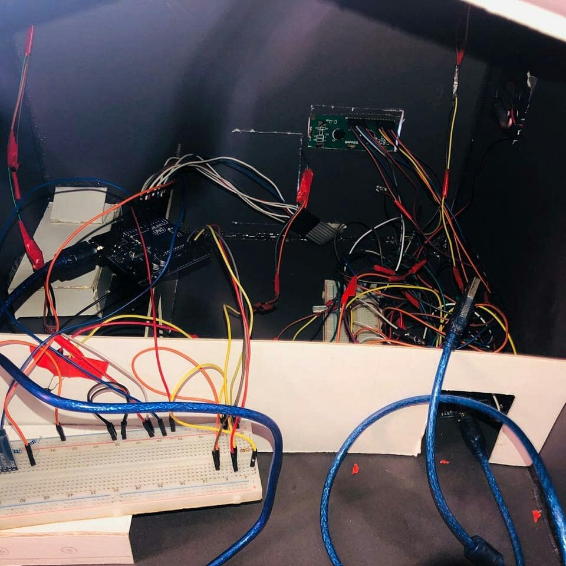

## The Peace of Mind App
Application for people who suffer from Alzahimer 
## Team members:
* Abdullah Elsayed
* Abdullah Darwesh
* Renad Taher
* Renad Abdelfatah
* Mohamed omar

## Features
we connect the App through bluetooth in  smart home 
* Notification when someone come and enter the correct password to get some information of person 
  * to see this featue transmit through arduino `Serial.print("#abdallah$")`
* Profile of the Person(not done yet)
* Profile of his/her relatives(not done yet)
* Medicine Reminder
## Hardware of the Smarthome

